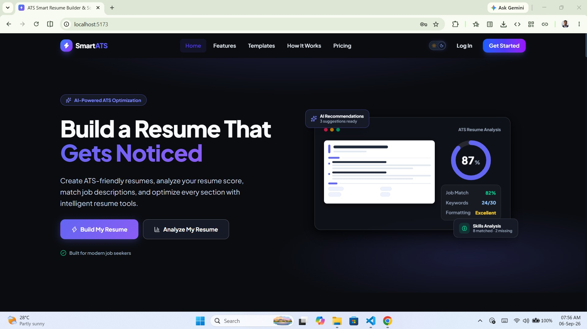
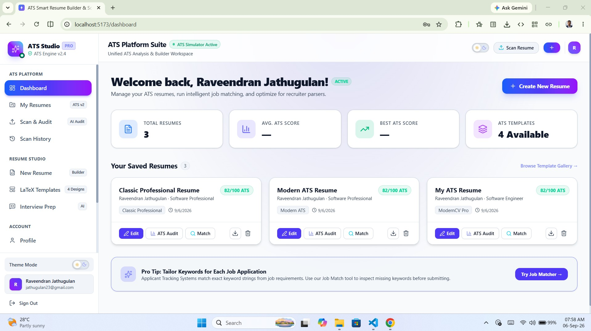
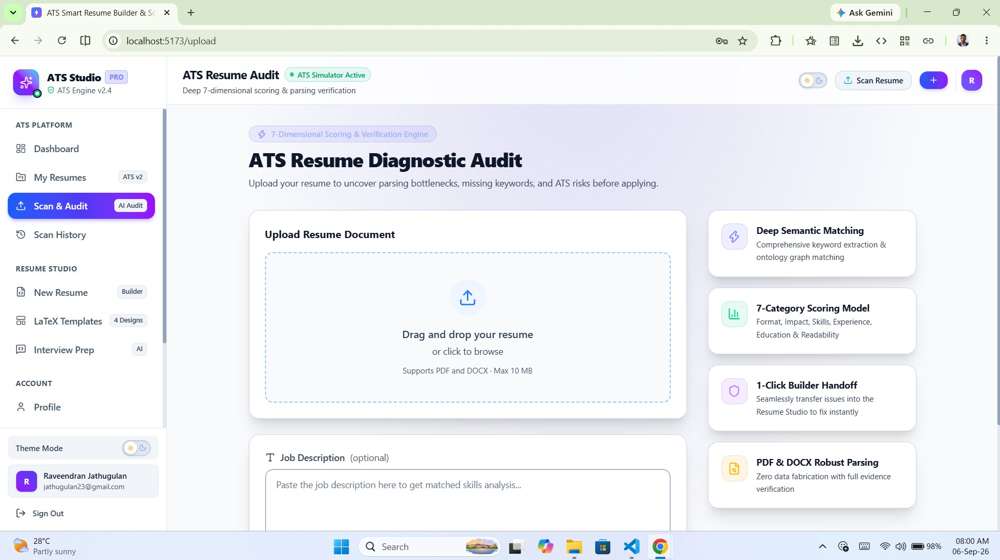
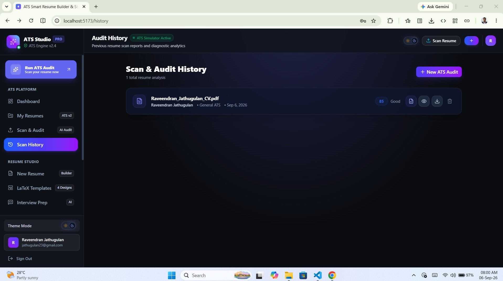
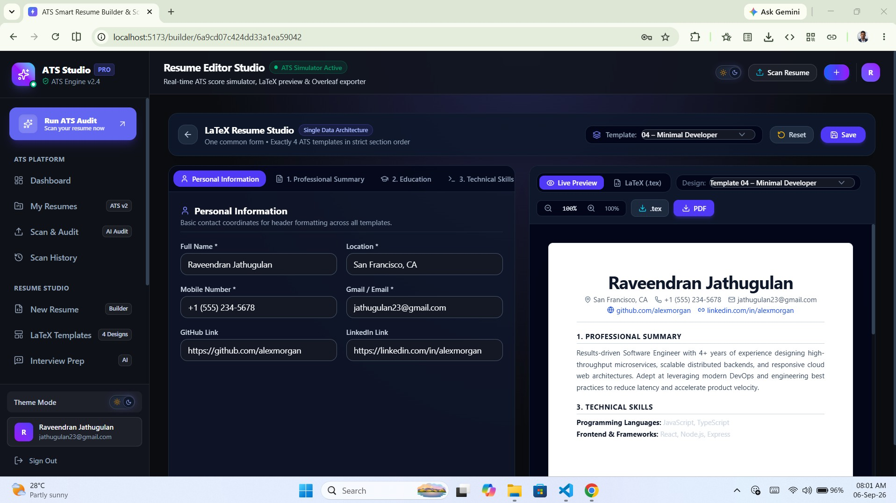
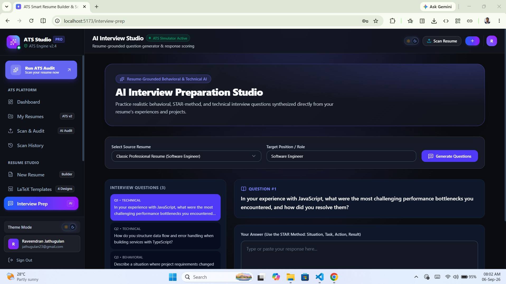

# 🚀 SmartATS — ATS Resume Builder & Score Analyzer

<p align="center">
  <strong>Build Smart · Get Hired</strong>
</p>

<p align="center">
  AI-powered resume intelligence, ATS optimization, LaTeX resume generation, and interview preparation — all in one premium platform.
</p>

<p align="center">


</p>

---

## 🌟 Overview

**SmartATS** is a full-stack, AI-powered **ATS Resume Builder & Score Analyzer** designed to help candidates create, analyze, optimize, and improve resumes for modern Applicant Tracking Systems.

The platform combines:

* 🔍 Deep ATS Resume Auditing
* 🧠 AI-powered job-description matching
* 📊 7-dimensional resume scoring
* 📝 LaTeX Resume Builder
* 🎨 ATS-optimized resume templates
* 🎯 Interview Preparation Studio
* 💬 STAR behavioral interview evaluation
* 📈 Resume analytics and scan history
* 🌗 Premium Dark/Light theme
* 🔐 Secure authentication
* 📄 PDF/DOCX resume parsing
* ⚡ Real-time resume optimization

> **SmartATS transforms a traditional resume into a data-driven career optimization workflow.**

---

# 📸 Screenshots

## 🏠 Landing Page

<p align="center">
  
</p>

---

## 📊 ATS Dashboard

<p align="center">
  
</p>

The dashboard provides a centralized workspace for:

* 📊 ATS score overview
* 🔍 Resume audits
* 📈 Resume analytics
* 📄 Recent scans
* 🎯 Job matching
* 📝 Resume Builder
* 🎤 Interview Preparation
* 📚 Scan History

---

## 🔍 ATS Audit

<p align="center">
  
</p>

Analyze resumes across multiple ATS-critical dimensions and identify areas that require improvement.

---

## 📈 Scan History

<p align="center">
  
</p>

Track previous resume analyses and compare ATS performance over time.

---

## 📝 LaTeX Resume Studio

<p align="center">
  
</p>

Create professional, ATS-friendly resumes using modular LaTeX templates with live preview and PDF generation.

---

## 🎤 Interview Preparation Studio

<p align="center">
  
</p>

Prepare for technical and behavioral interviews using questions generated from the candidate's resume and target role.

---

# 🚀 Core Features

## 🔍 1. ATS Resume Diagnostic Audit

SmartATS provides a comprehensive **7-dimensional ATS diagnostic engine**.

### 📊 Seven-Dimensional Scoring

| Dimension                  | Description                               |
| -------------------------- | ----------------------------------------- |
| 🎯 Overall ATS Score       | Resume compatibility score from 0–100     |
| 🔑 Keyword Matching        | Job-description keyword alignment         |
| 🧾 ATS Parseability        | Formatting and parsing compatibility      |
| 💼 Experience Impact       | Achievement quality and measurable impact |
| 🎓 Education & Credentials | Education and certification verification  |
| 📖 Readability             | Section hierarchy, readability and length |
| 🧠 Skills Analysis         | Hard and soft skill classification        |

### 🔎 Job Description Matching

Paste any job description and SmartATS analyzes:

* 🔑 Missing keywords
* ✅ Matching keywords
* 🧠 Semantic similarities
* 💼 Required skills
* 📌 Experience requirements
* 🎓 Education requirements
* ⚠️ Resume gaps

---

# 🧠 2. Evidence-Based Resume Analysis

SmartATS follows an **evidence-first philosophy**.

The system focuses on extracting and validating information already present in the resume.

### 🚫 No Resume Fabrication

SmartATS should never invent:

* ❌ Work experience
* ❌ Skills
* ❌ Certifications
* ❌ Education
* ❌ Job titles
* ❌ Achievements

Instead, recommendations are grounded in the candidate's existing resume evidence.

---

# 📝 3. Overleaf-Grade LaTeX Resume Studio

Create professional resumes using ATS-friendly LaTeX templates.

### 📚 Included Templates

#### 💼 Classic Professional

* Strict single-column layout
* Corporate-friendly typography
* ATS-focused structure
* Clean professional hierarchy

#### 💻 Modern ATS

* Designed for software engineers
* High keyword visibility
* Technical skills optimized
* Developer-friendly structure

#### 🎓 ModernCV Professional

* Academic-oriented layout
* Senior technical profile support
* Structured experience presentation

#### 👨‍💻 Minimal Developer

* Minimalist developer aesthetic
* Clean typography
* Compact structure
* Full-stack developer focused

---

# 📑 Mandatory Resume Structure

SmartATS maintains a consistent resume hierarchy:

```text
1. Professional Summary
2. Education
3. Technical Skills
4. Experience
5. Projects
6. Certifications
7. Referees
```

Technical skills can be categorized into:

```text
Languages
Frontend
Backend
Databases
Cloud & DevOps
Tools
Security
Other Technologies
```

---

# ⚡ 4. Live LaTeX Compilation

The Resume Studio supports:

* ⚡ Instant `.tex` generation
* 👀 Live preview
* 📋 Copy LaTeX source
* 📄 PDF generation
* 🖨️ Vector-quality output
* 🔄 Resume content synchronization
* 🧩 Modular template architecture
* 🛡️ PDFKit fallback when LaTeX compilation is unavailable

---

# 🎯 5. AI Career Tools

SmartATS goes beyond resume scoring.

### 🤖 AI Resume Optimization

Generate actionable recommendations for:

* Resume summary
* Experience bullets
* Project descriptions
* Technical skills
* Achievement statements
* Keyword coverage

### 📌 Smart Recommendations

Each recommendation should explain:

```text
Problem
   ↓
Why it matters
   ↓
Recommended improvement
   ↓
Expected ATS impact
```

---

# 🎤 6. Interview Preparation Studio

Prepare for interviews using your resume as the source of truth.

### 🧑‍💼 Behavioral Interview

Generate questions around:

* Leadership
* Teamwork
* Conflict
* Problem solving
* Communication
* Adaptability
* Failure
* Ownership

### 💻 Technical Interview

Generate questions based on:

* Programming languages
* Frameworks
* Databases
* APIs
* System design
* Projects
* Development experience

### ⭐ STAR Framework

Evaluate answers using:

```text
S — Situation
T — Task
A — Action
R — Result
```

Provide:

* ⭐ Response score
* 💡 Improvement suggestions
* ⚠️ Missing elements
* 📌 Stronger STAR structure
* 🎯 Follow-up questions

---

# 📊 7. Advanced Resume Analytics

Track resume performance over time.

### 📈 Analytics

Monitor:

* ATS score
* Keyword score
* Formatting score
* Skills score
* Experience score
* Resume completeness
* Job-description alignment

### 📊 Score Evolution

```text
Previous Scan
      ↓
Optimization
      ↓
New Scan
      ↓
Score Comparison
      ↓
Improvement Insights
```

---

# 🗂️ 8. Scan History

Keep track of previous ATS audits.

Each scan can display:

* 📄 Resume name
* 📅 Scan date
* 🎯 ATS score
* 🔑 Keyword score
* 🧾 Formatting score
* 💼 Experience score
* 🎓 Education score
* 📖 Readability score
* 🧠 Skills score

Users can quickly:

* 👁️ View report
* 🔄 Re-run audit
* 📊 Compare results
* 🗑️ Delete scan

---

# 🎨 9. Premium UI / UX

SmartATS follows a modern **Apple HIG-inspired SaaS design system**.

### 🌙 Dark Mode

Features:

* Deep navy surfaces
* Electric blue accents
* Purple gradients
* Cyan highlights
* Glassmorphism
* Ambient glow effects
* High-contrast typography

### ☀️ Light Mode

Features:

* Clean white surfaces
* Soft neutral backgrounds
* Premium borders
* Subtle shadows
* Strong typography
* Clear card separation

### ♿ Accessibility First

Every:

* 🔘 Button
* 🃏 Card
* 🧭 Navigation item
* 🎨 Icon
* 📝 Text
* 📊 Chart
* 🔍 Input

must remain clearly visible in both themes.

> **No text or icon should ever disappear into the background.**

---

# 🧭 10. Smart Dashboard

The dashboard acts as the central career intelligence hub.

### Sidebar

```text
🏠 Dashboard

🔍 Scan Audit
   └── ATS Run ATS Audit

📚 Scan History

📝 Resume Builder

📄 LaTeX Templates

🎤 Interview Preparation

📊 Analytics

⚙️ Settings
```

---

# 🧩 11. Advanced Resume Intelligence

Future-ready capabilities can include:

### 🧠 Semantic Skill Ontology

Group related technologies:

```text
JavaScript
├── React
├── Node.js
├── Express
└── Next.js
```

This enables more intelligent keyword matching than simple string comparison.

### 🔗 Skill Relationship Detection

Identify relationships between:

* Technologies
* Job requirements
* Projects
* Experience
* Certifications

---

# 📌 12. Job-Specific Resume Optimization

Allow users to maintain multiple target jobs.

Example:

```text
Resume
   ↓
Target Job Description
   ↓
ATS Analysis
   ↓
Missing Keywords
   ↓
Optimization Suggestions
   ↓
Updated Resume
   ↓
Re-scan
```

---

# 🧪 13. Resume Quality Checks

SmartATS can detect:

### ⚠️ Formatting Problems

* Tables
* Columns
* Complex layouts
* Unsupported symbols
* Unusual fonts
* Missing sections

### ✍️ Content Problems

* Weak action verbs
* Generic descriptions
* Missing metrics
* Long paragraphs
* Repeated keywords
* Missing achievements

### 📏 Length Analysis

Detect whether the resume is:

* Too short
* Optimal
* Too long

---

# 🔐 Security & Privacy

SmartATS follows security-focused development practices.

### 🔒 Authentication

* JWT authentication
* bcrypt password hashing
* Protected routes
* Token-based authorization

### 🛡️ Backend Security

* Helmet
* CORS
* Express Rate Limit
* Multer validation
* Input validation
* Secure API architecture

### 📁 File Security

Supported files:

```text
.pdf
.doc
.docx
```

Maximum upload size:

```text
10 MB
```

---

# 🛠️ Tech Stack

## 🎨 Frontend

| Technology             | Purpose                   |
| ---------------------- | ------------------------- |
| ⚛️ React 19            | UI framework              |
| ⚡ Vite 6               | Development/build tooling |
| 🧭 React Router DOM v7 | Routing                   |
| 🎨 Tailwind CSS v4     | Styling                   |
| 🧩 Vanilla CSS         | Design tokens             |
| 🖼️ Lucide React       | Icons                     |
| 🎬 Framer Motion       | Animations                |
| 🔐 React Context       | Global state              |
| 💾 LocalStorage        | Persistence               |

---

## ⚙️ Backend

| Technology            | Purpose          |
| --------------------- | ---------------- |
| 🟢 Node.js            | Runtime          |
| 🚂 Express.js         | REST API         |
| 🍃 MongoDB            | Database         |
| 🦫 Mongoose           | ODM              |
| 🔐 JWT                | Authentication   |
| 🔑 bcryptjs           | Password hashing |
| 📄 pdf-parse          | PDF parsing      |
| 📝 mammoth            | DOCX parsing     |
| 📑 PDFKit             | PDF fallback     |
| 🛡️ Helmet            | Security         |
| 🚦 Express Rate Limit | API protection   |
| 📤 Multer             | File uploads     |

---

# 🏗️ Architecture

```text
                    ┌─────────────────────┐
                    │     SmartATS UI     │
                    │   React + Vite      │
                    └──────────┬──────────┘
                               │
                               ▼
                    ┌─────────────────────┐
                    │    REST API Layer   │
                    │       Express       │
                    └──────────┬──────────┘
                               │
              ┌────────────────┼────────────────┐
              ▼                ▼                ▼
       ┌────────────┐   ┌────────────┐   ┌────────────┐
       │ ATS Engine │   │ Auth       │   │ Resume     │
       │            │   │ Service    │   │ Services   │
       └────────────┘   └────────────┘   └────────────┘
              │                │                │
              └────────────────┼────────────────┘
                               ▼
                    ┌─────────────────────┐
                    │      MongoDB        │
                    │     Mongoose        │
                    └─────────────────────┘
```

---

# 📁 Project Structure

```text
ATS Resume Analyzer/
│
├── backend/
│   ├── src/
│   │   ├── config/
│   │   ├── controllers/
│   │   ├── middleware/
│   │   ├── models/
│   │   ├── routes/
│   │   ├── services/
│   │   └── templates/
│   │
│   ├── package.json
│   └── .env.example
│
├── frontend/
│   ├── src/
│   │   ├── api/
│   │   ├── components/
│   │   │   ├── auth/
│   │   │   ├── builder/
│   │   │   ├── common/
│   │   │   ├── layout/
│   │   │   ├── results/
│   │   │   └── upload/
│   │   │
│   │   ├── context/
│   │   ├── pages/
│   │   ├── routes/
│   │   ├── index.css
│   │   └── App.jsx
│   │
│   ├── package.json
│   └── vite.config.js
│
├── docs/
│   └── screenshots/
│       ├── home.png
│       ├── dashboard.png
│       ├── ats-audit.png
│       ├── scan-history.png
│       ├── latex-builder.png
│       └── interview-preparation.png
│
└── README.md
```

---

# ⚙️ Getting Started

## 📋 Prerequisites

Install:

* Node.js `18+`
* MongoDB
* npm
* Optional: `pdflatex`

---

## 1️⃣ Clone Repository

```bash
git clone https://github.com/YOUR_USERNAME/smartats.git

cd smartats
```

---

## 2️⃣ Backend Setup

```bash
cd backend

npm install

cp .env.example .env
```

Configure:

```env
PORT=5000
MONGO_URI=mongodb://localhost:27017/smartats
JWT_SECRET=your_secure_secret
```

Seed the ATS templates:

```bash
npm run seed
```

Start backend:

```bash
npm run dev
```

Backend:

```text
http://localhost:5000
```

---

## 3️⃣ Frontend Setup

```bash
cd ../frontend

npm install

npm run dev
```

Frontend:

```text
http://localhost:5173
```

---

# 🔌 API Modules

SmartATS follows a modular REST API architecture.

### 🔐 Authentication

```text
POST /api/auth/register
POST /api/auth/login
GET  /api/auth/me
```

### 🔍 ATS Audit

```text
POST /api/audit
GET  /api/audit/:id
GET  /api/audit/history
DELETE /api/audit/:id
```

### 📝 Resume Builder

```text
POST /api/resumes
GET  /api/resumes
GET  /api/resumes/:id
PUT  /api/resumes/:id
DELETE /api/resumes/:id
```

### 📄 Templates

```text
GET /api/templates
GET /api/templates/:id
```

> Adjust endpoint names to match the actual implementation in the project.

---

# 🧪 Development Workflow

```text
Create Resume
      ↓
Upload / Enter Resume
      ↓
Add Job Description
      ↓
Run ATS Audit
      ↓
7-Dimensional Analysis
      ↓
Identify Gaps
      ↓
Apply Recommendations
      ↓
Generate Optimized Resume
      ↓
Re-run ATS Audit
      ↓
Compare Score
      ↓
Prepare for Interview
```

---

# 🚀 Advanced Features Roadmap

Future SmartATS versions can include:

* 🤖 AI-powered resume rewriting
* 🧠 Advanced semantic keyword ontology
* 📊 Resume score benchmarking
* 🎯 Job-specific resume variants
* 🔄 One-click resume optimization
* 📬 Job application tracker
* 🗓️ Interview scheduling
* 🎤 AI mock interviews
* 🗣️ Voice-based interview practice
* 📹 Video interview analysis
* 🧑‍💼 Recruiter dashboard
* 🏢 Company-specific ATS profiles
* 🌍 Multi-language resume generation
* 📄 Cover Letter Studio
* 💌 Personalized application email generator
* 🔗 LinkedIn profile optimization
* 📈 Application success analytics
* 🧠 Skill-gap learning recommendations
* 🏆 Resume version management
* 📦 Export to PDF/DOCX/LaTeX
* ☁️ Cloud resume storage
* 🔐 Two-factor authentication
* 📊 Advanced candidate analytics

---

# 💡 Product Philosophy

SmartATS is built around a simple principle:

> **Don't just create a resume. Build a resume strategy.**

The platform connects:

```text
Resume
  +
Job Description
  +
ATS Intelligence
  +
Optimization
  +
Interview Preparation
  =
Career Readiness
```

---

# 🎯 Target Users

SmartATS is designed for:

* 🎓 University students
* 👨‍💻 Software developers
* 🧑‍💼 Job seekers
* 🔄 Career switchers
* 🌱 Fresh graduates
* 🧑‍🔬 Technical professionals
* 🌍 International applicants
* 📈 Experienced professionals

---

# 🌟 Why SmartATS?

| Traditional Resume Tools   | SmartATS                       |
| -------------------------- | ------------------------------ |
| 📝 Static resume editor    | 🧠 Resume intelligence         |
| ❌ No ATS diagnostics       | 🔍 7-dimensional audit         |
| ❌ Generic templates        | 📄 ATS-focused LaTeX templates |
| ❌ Manual keyword checking  | 🔑 Semantic matching           |
| ❌ No historical insights   | 📈 Scan history                |
| ❌ Separate interview tools | 🎤 Integrated interview studio |
| ❌ Basic formatting         | 🎨 Premium SaaS UI             |
| ❌ One-size-fits-all        | 🎯 Job-specific optimization   |

---

# 🧑‍💻 Contributing

Contributions are welcome.

```bash
git checkout -b feature/amazing-feature

git commit -m "feat: add amazing feature"

git push origin feature/amazing-feature
```

Then open a Pull Request.

---

# 📄 License

This project is licensed under the **MIT License**.

---

# ⭐ Support the Project

If you find SmartATS useful:

⭐ Star the repository
🍴 Fork the project
🐛 Report issues
💡 Suggest features
🤝 Submit pull requests

---

<p align="center">

### 🚀 SmartATS

**Build Smart · Get Hired**

</p>

<p align="center">
Built with ❤️ using React, Node.js, Express, MongoDB and modern AI-powered career technology.
</p>
